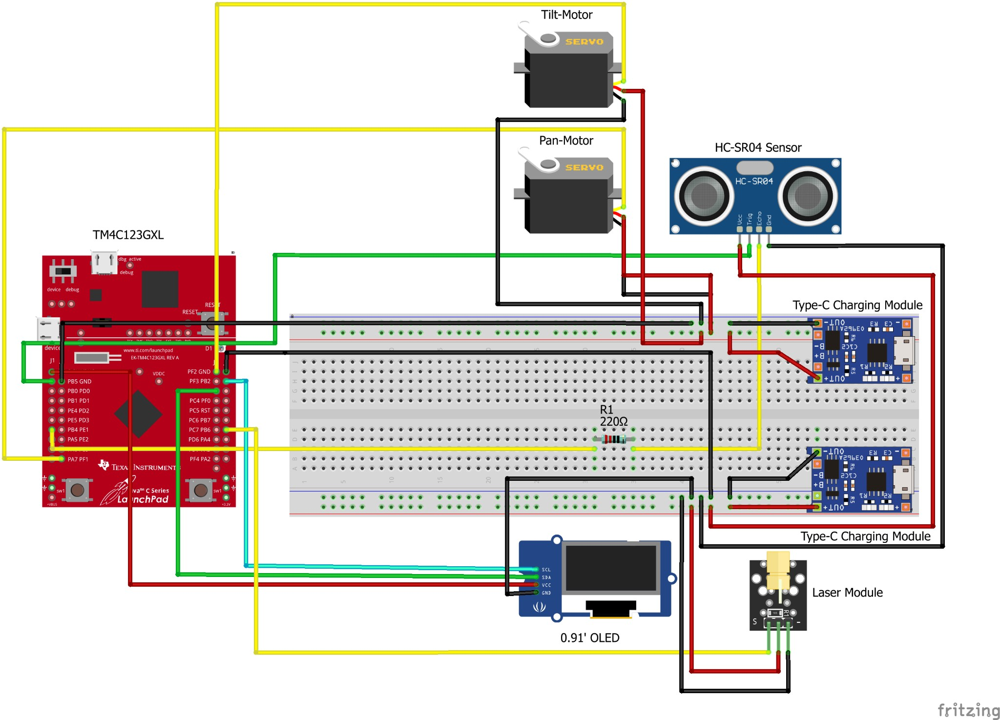

# Real-Time Target Tracking Laser Turret

> Real-time embedded system integrating sensing, control, and actuation using TM4C123GXL.

---

## 📌 Overview

This project implements an autonomous laser turret capable of detecting and tracking objects in real time using an ultrasonic sensor.

The system continuously scans its surroundings and locks onto targets within a predefined threshold distance. It integrates sensing, actuation, and display modules to simulate an intelligent embedded tracking system for robotics and surveillance applications.

---

## 🚀 Features

- Real-time object detection using HC-SR04 ultrasonic sensor  
- Pan-tilt tracking using dual servo motors (0°–180°)  
- Automatic target locking within **30 cm range**  
- Laser activation on target detection  
- OLED display for real-time feedback (distance / lock status)  
- Continuous scanning with smooth servo motion  
- Noise-reduced distance measurement using moving average filtering  

---

## 🧠 System Architecture

### 🧩 Block Diagram

### Components:
- **Microcontroller:** TM4C123GXL (control unit)  
- **Sensor:** Ultrasonic sensor (distance measurement)  
- **Actuators:** Servo motors (pan & tilt motion)  
- **Output:** Laser module (target indication)  
- **Display:** OLED (I²C communication)  

---

## 🔄 Working

1. Ultrasonic sensor continuously measures object distance  
2. Distance data is processed and filtered using moving average  
3. If distance ≤ 30 cm:
   - Servo movement stops  
   - Laser is activated  
   - OLED displays **"TARGET LOCKED"**  
4. If no object is detected:
   - System continues scanning  
   - Distance is displayed on OLED  

---

## 📊 Results

- Distance measurement accuracy: **±1 cm**  
- Servo motion range: **0°–180°**  
- Real-time response achieved with stable tracking  
- Reliable target locking within threshold range  

---

## 🎥 Demo

[Watch Demo Video](https://drive.google.com/file/d/1wN-HqL7u_J5BtfhbBMFW_SnpxHUnpaQ0/view?usp=drive_link)

---

## 📄 Documentation

- [Detailed Project Report](docs/project_report.pdf)

---

## 🛠 Hardware Components

- TM4C123GXL LaunchPad  
- HC-SR04 Ultrasonic Sensor  
- MG995 Servo Motors (x2)  
- Laser Module  
- SSD1306 OLED Display (I²C)  
- Breadboard, resistors, jumper wires  

---

## 💻 Software

- Energia IDE  
- TivaWare Peripheral Library  
- Embedded C  

---

## ⚙️ Implementation Details

- Custom I²C communication using bit-banging  
- PWM-based servo control using timed pulses  
- Moving average filter for stable distance measurement  
- Real-time control loop with periodic updates  
- Threshold-based decision system for target locking  

---

## 📌 Applications

- Surveillance and security systems  
- Robotics and automation  
- Target tracking systems  
- Industrial positioning systems  

---

## 🔮 Future Work

- Camera-based tracking using OpenCV  
- Machine learning-based object detection  
- Wireless control (Wi-Fi / Bluetooth)  
- Autonomous calibration and tracking optimization  

---

## 👤 Author

**Ansh Verma**  
ECE Student — VLSI, Communication & Embedded Systems  

- 📧 07anshverma@gmail.com  
- 🔗 https://www.linkedin.com/in/ansh07verma  
- 💻 https://github.com/ansh07verma
